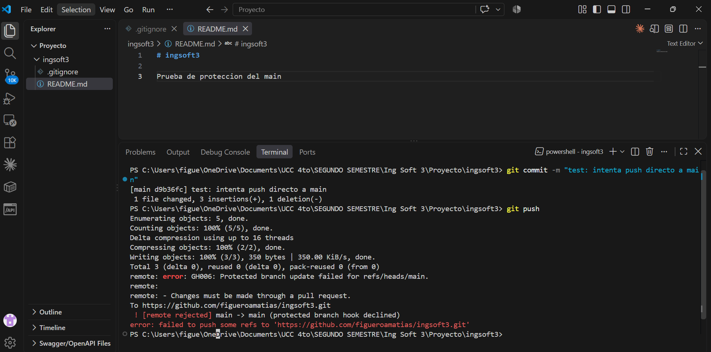
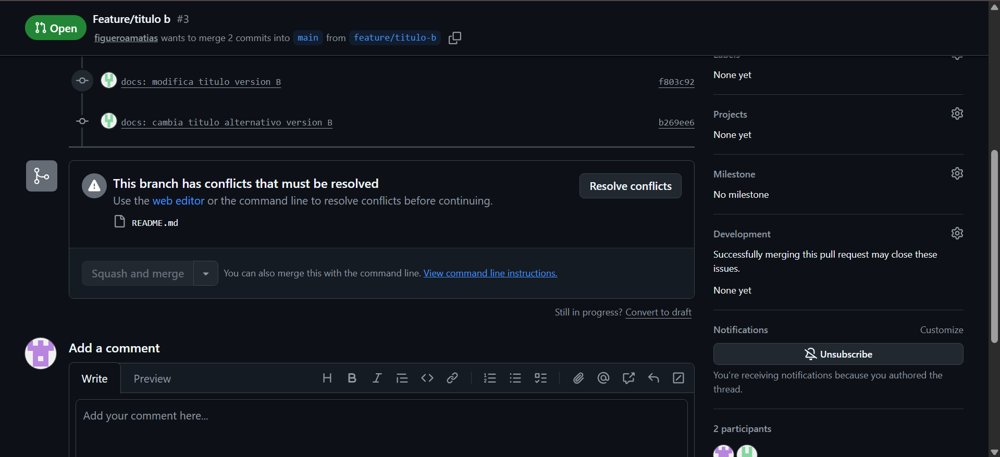
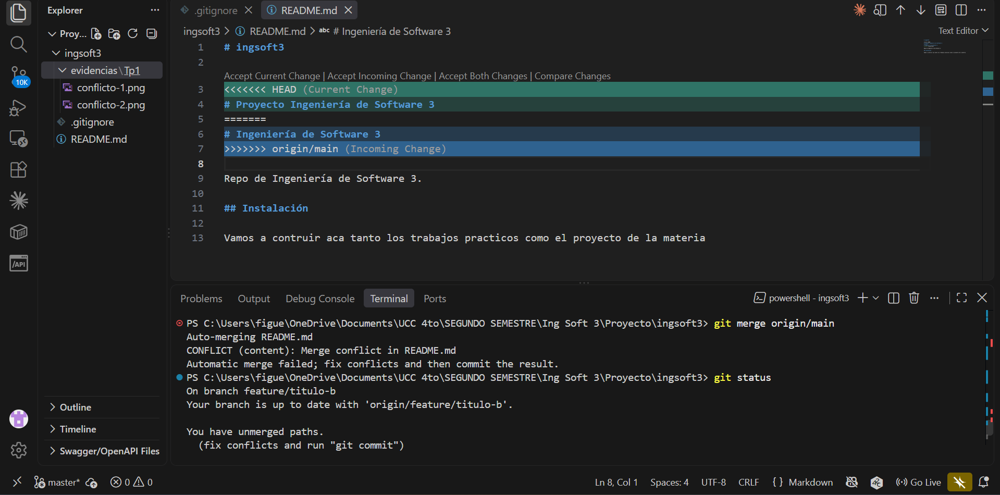
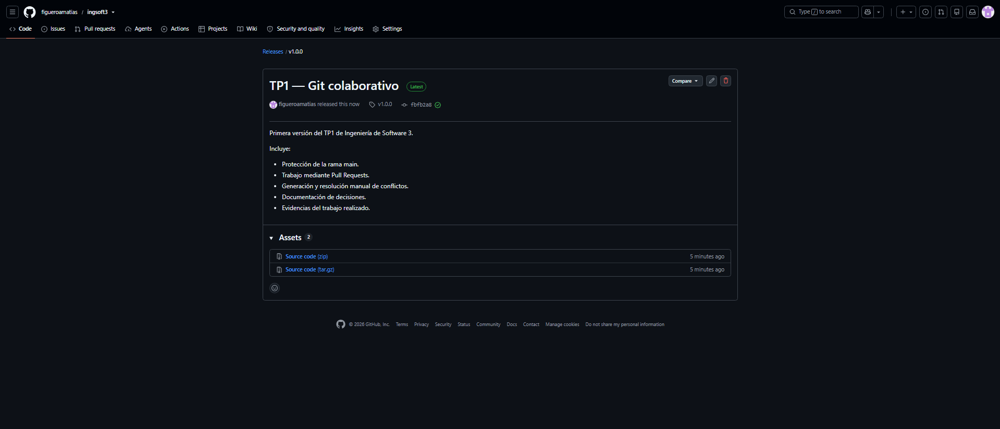
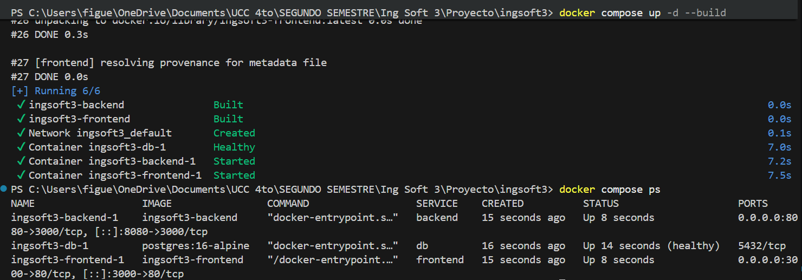
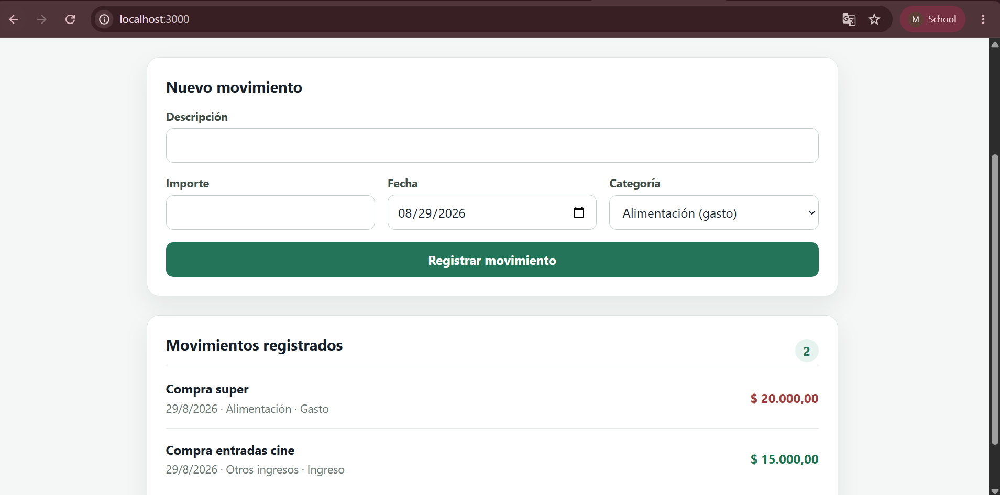
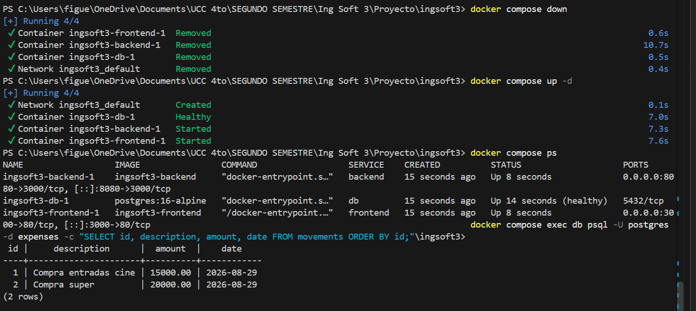
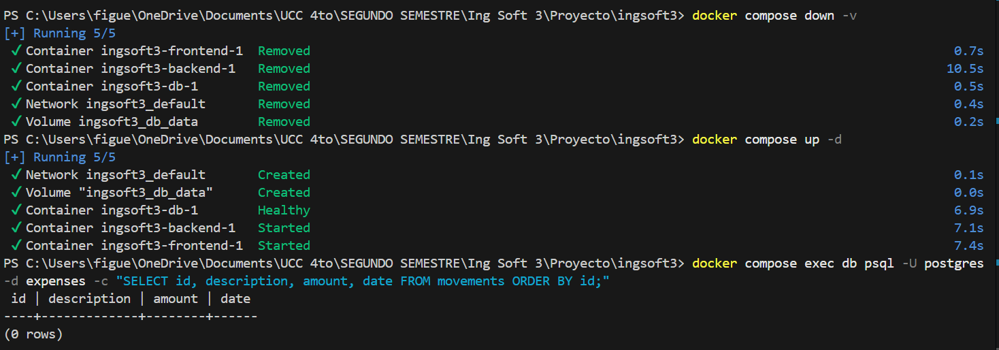
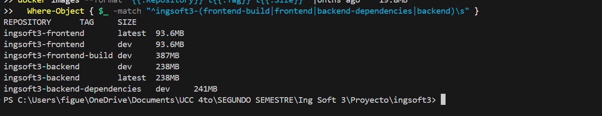
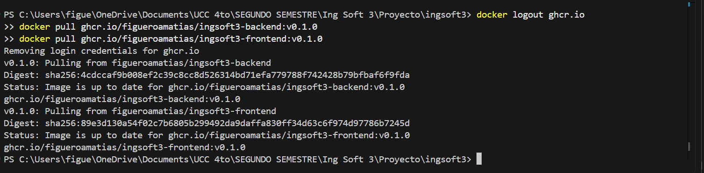

# Evidencias

## TP1 — Git colaborativo

### Evidencia 1 — Push directo rechazado

Se intentó realizar un push directamente sobre `main`. GitHub rechazó la operación debido a la protección de la rama.

### Evidencia 2 — Conflicto detectado en Pull Request

GitHub detectó un conflicto en `README.md` entre `main` y `feature/titulo-b`.

### Evidencia 3 — Conflicto local

Al integrar `main` dentro de `feature/titulo-b`, Git mostró los marcadores de conflicto que debieron resolverse manualmente.

### Evidencia 4 — Release v1.0.0

Se publicó la primera versión estable correspondiente al TP1.

## TP2 — Docker y Compose

### Evidencia 1 — Compose desde cero

Se ejecutó `docker compose up -d --build`. La salida demuestra la construcción e inicio de frontend y backend, la creación de la red y el inicio de PostgreSQL. `docker compose ps` confirma los tres servicios en ejecución y la base de datos en estado `healthy`.

### Evidencia 2 — Sistema end-to-end

La aplicación se encuentra disponible en `localhost:3000`. El formulario, las categorías y los movimientos registrados demuestran el flujo completo Nginx → backend → PostgreSQL con datos reales.

### Evidencia 3 — Persistencia

Después de ejecutar `docker compose down` y volver a iniciar con `docker compose up -d`, los movimientos continúan almacenados. Esto confirma que los datos se conservan en el volumen nombrado aunque los contenedores sean eliminados y recreados.

### Evidencia 4 — Eliminación del volumen

Se ejecutó `docker compose down -v`, eliminando contenedores, red y volumen. Después de un nuevo `docker compose up -d`, la consulta no devuelve los movimientos anteriores, porque PostgreSQL fue inicializado nuevamente desde `database/init.sql`.

### Evidencia 5 — Tamaños de las imágenes

La captura muestra los tamaños informados por Docker:

- Frontend final `ingsoft3-frontend:latest`: 93.6 MB.
- Etapa de build `ingsoft3-frontend-build:dev`: 387 MB.
- Backend final `ingsoft3-backend:latest`: 238 MB.
- Etapa de dependencias `ingsoft3-backend-dependencies:dev`: 241 MB.

Las etapas de build contienen las herramientas necesarias para instalar y compilar. Las imágenes finales conservan solamente el runtime y los archivos requeridos para ejecutar cada servicio.

### Evidencia 6 — Registry

Se cerró la sesión mediante `docker logout ghcr.io` y luego se descargaron correctamente `ghcr.io/figueroamatias/ingsoft3-backend:v0.1.0` y `ghcr.io/figueroamatias/ingsoft3-frontend:v0.1.0`. Esto confirma que ambas imágenes fueron publicadas en GHCR y son descargables sin autenticación.

